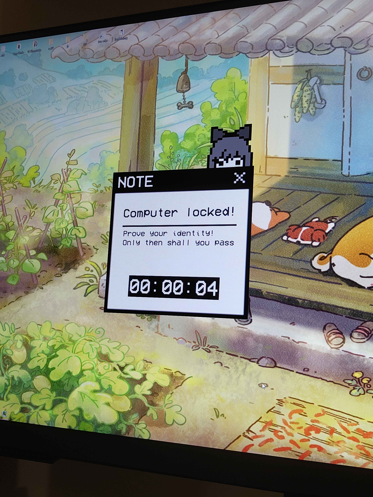
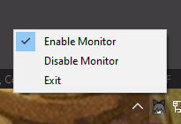
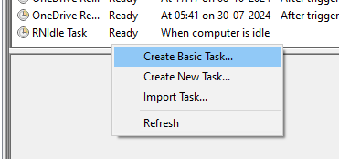
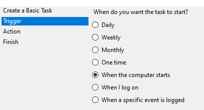
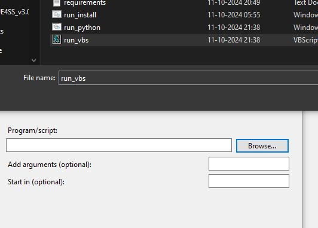
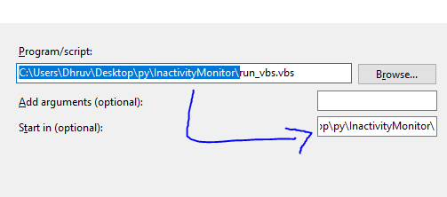
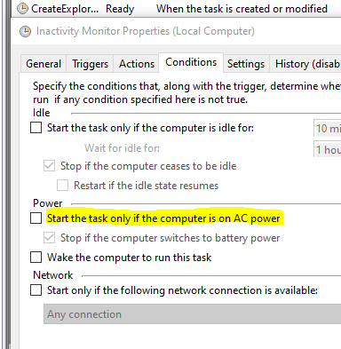

# Inactivity Monitor

A small python app to lock your computer when you're idle on the desktop for too long. No more snoopers!



## Installation

Note that this was built for a *Windows* machine, you cannot run this on a linux machine.

+ Install python from [Microsoft Store](https://apps.microsoft.com/detail/9ncvdn91xzqp) or the [Official Python Website](https://www.python.org/downloads/release/python-3126/). Any version above 3.10 should work, but I used 3.12.

+ Run `run_install.bat` to install all required dependencies
+ Run `run_python.bat` (with console) or `run_vbs.vbs` (without console) to start the app!
+ You may then control the app through the tray icon.
+ Optionally, you may add the `run_vbs.vbs` file to your task scheduler to run on boot!

## Options

+ You may enable/disable the monitor through the tray icon.



+ You may change the following properties in `checker.pyw`:

```py
# How many seconds to wait before locking 
IDLE_LIMIT = 3
# Modules to enable/disable
KEYBOARD_BLOCK = True
MOUSE_BLOCK = True
# To avoid the ctrl+alt+delete bypass.
# Only works when computer on lockdown, don't worry!
TASK_MANAGER_KILLER = True
"""
Make sure your unlock combination works! See the pynput.Key objects for special keys.
Use NON_LETHAL mode to test that your unlock combination actually works before deploying
"""
# Unlock combination and mode
UNLOCK_COMBINATION = ["o", "p", "p", "o"]
NON_LETHAL = False # Nothing gets locked with this mode on, but the rest of the app will work.
```

### NOTE

The password by default is **"oppo"**, you will have to type that into your keyboard to unlock your device unless you change it

## Adding to task scheduler

+ Open up Task Scheduler on your system

+ Right click "Task Scheduler Library" and select "Create Basic Task"



+ Enter any name for the task

+ Trigger when the I log on



+ Start a Program

+ Click on "Browse" and look for the `run_vbs.vbs` file



+ Put the folder path in the "Start in" option



+ If you are on a laptop, might help to disable this



+ Done! Every time you start your computer, the inactivity monitor will run

## Komorebi Integration

If you use [Komorebi](https://github.com/LGUG2Z/komorebi) on your system, you can turn `KOMOREBI_INTEGRATION_ENABLED` to `True`. This adds an additional criteria where if you switch to a blank workspace and stay there for too long, it assumes inactivity.

## Credits

+ The `character.png` comes from [dinopixel.com](https://dinopixel.com/guess-the-character-from-just-black-and-white-color-pixel-art-10625) and the author is [Squidgril202](https://dinopixel.com/user/squidgril202). You may not use this character anywhere without explicit permission from the owner, and the license of this repo does not cover it.

+ The font included in the repository is [VCR OSD Mono](https://www.dafont.com/vcr-osd-mono.font) and the author is [Riciery Santos Leal](https://www.dafont.com/mrmanet.d5509). You may not use this font for commercial purposes.
